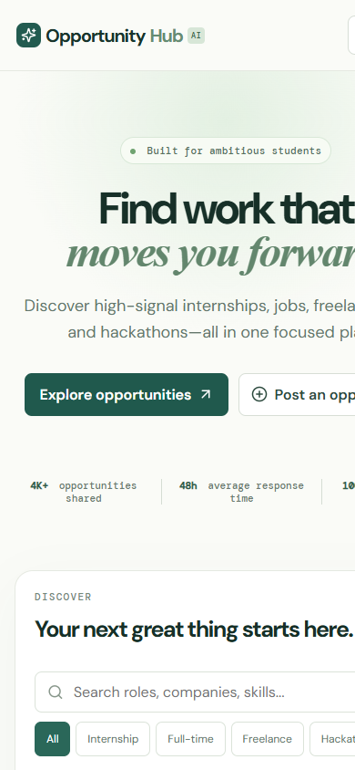

# OpportunityHub

> **AI-powered platform for discovering internships, jobs, hackathons, scholarships, certifications, and career opportunities in one focused place.**

[](LICENSE)
[](https://supabase.com)
[](https://react.dev)
[](https://www.typescriptlang.org/)

---

## 📸 Screenshots & UI Preview

### Desktop Dashboard Overview


<details>
<summary>📱 <b>Click to view Mobile Responsive View</b></summary>

<br />



</details>

---

## ✨ Features

- 🔍 **Live Search & Category Filtering**: Search across roles, companies, and required skills for Internships, Full-Time, Freelance, and Hackathons.
- ⚡ **Instant Community Posting**: Submit new career opportunities directly through the built-in community submission modal.
- 🔖 **Bookmark & Save Opportunities**: Save target positions to your account with Supabase integration.
- 🛡️ **PostgreSQL & Row-Level Security**: Production-ready Supabase backend with custom migration schemas and automatic profile provisioning.
- 📱 **100% Responsive Design**: Clean typography and micro-interactions optimized across desktop and mobile.

---

## 🚀 Quick Start

### 1. Clone & Install Dependencies

```bash
git clone https://github.com/abhinavshukla152005-beep/OpportunityHub.git
cd OpportunityHub
npm install
```

### 2. Environment Setup

Copy .env.example to .env.local:

```bash
cp .env.example .env.local
```

### 3. Run Development Server

```bash
npm run dev
```

Build the production distribution bundle with:

```bash
npm run build
```

---

## 🗄️ Database & Supabase Migration

The platform is configured for Supabase. Execute supabase/migrations/20260910_create_opportunityhub.sql in your Supabase SQL Editor to establish:
- profiles, opportunities, saved_opportunities, and pplications tables.
- Automatic profile creation triggers.
- Strict Row-Level Security (RLS) policies.

---

## 📄 License

Distributed under the [MIT License](LICENSE). Built by **[Abhinav Shukla](https://github.com/abhinavshukla152005-beep)**.
